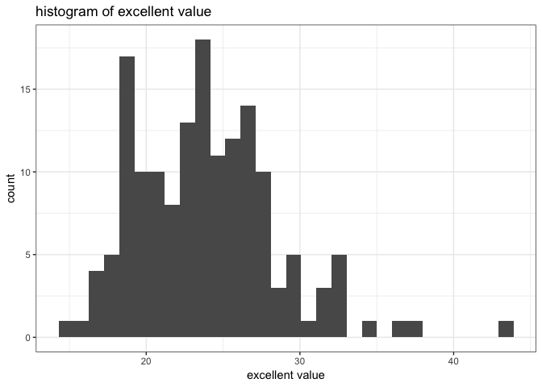
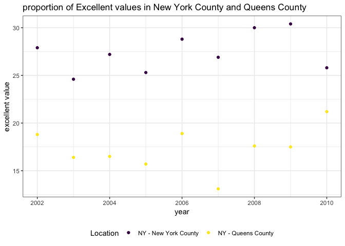

p8105\_hw2\_gw2383
================
Guojing Wu
2018/10/1

-   [Problem 0](#problem-0)
-   [Problem 1](#problem-1)
    -   [Read, clean, retain and convert the data](#read-clean-retain-and-convert-the-data)
    -   [About this dataset](#about-this-dataset)
    -   [Some questions](#some-questions)
    -   [Reformat the data](#reformat-the-data)
-   [Problem 2](#problem-2)
    -   [Read and clean the Mr. Trash Wheel sheet](#read-and-clean-the-mr.-trash-wheel-sheet)
    -   [Read and clean the precipitation data](#read-and-clean-the-precipitation-data)
    -   [About these data](#about-these-data)
-   [Problem 3](#problem-3)
    -   [create the dataset](#create-the-dataset)
    -   [Answer questions](#answer-questions)

------------------------------------------------------------------------

Problem 0
---------

The folder contains the "entrance and exit for each subway station in NYC" is `local_data`.

Problem 1
---------

### Read, clean, retain and convert the data

``` r
subway_df = 
  read_csv("./local_data/NYC_Transit_Subway_Entrance_And_Exit_Data.csv") %>% # read data
  janitor::clean_names() %>% # cleaning the name
  select(line:entry, vending, ada, ada_notes) %>% # filter
  mutate(.data = .,
    entry = ifelse(entry == "YES", TRUE, FALSE)) # convert
```

    ## Parsed with column specification:
    ## cols(
    ##   .default = col_character(),
    ##   `Station Latitude` = col_double(),
    ##   `Station Longitude` = col_double(),
    ##   Route8 = col_integer(),
    ##   Route9 = col_integer(),
    ##   Route10 = col_integer(),
    ##   Route11 = col_integer(),
    ##   ADA = col_logical(),
    ##   `Free Crossover` = col_logical(),
    ##   `Entrance Latitude` = col_double(),
    ##   `Entrance Longitude` = col_double()
    ## )

    ## See spec(...) for full column specifications.

``` r
subway_df$entry[1:100]
```

    ##   [1]  TRUE  TRUE  TRUE  TRUE  TRUE  TRUE  TRUE  TRUE  TRUE  TRUE  TRUE
    ##  [12]  TRUE  TRUE FALSE  TRUE  TRUE  TRUE  TRUE  TRUE  TRUE  TRUE  TRUE
    ##  [23] FALSE  TRUE  TRUE  TRUE  TRUE  TRUE  TRUE  TRUE  TRUE  TRUE  TRUE
    ##  [34]  TRUE  TRUE  TRUE FALSE  TRUE  TRUE  TRUE  TRUE  TRUE  TRUE  TRUE
    ##  [45]  TRUE  TRUE  TRUE  TRUE  TRUE  TRUE  TRUE  TRUE  TRUE  TRUE  TRUE
    ##  [56]  TRUE  TRUE FALSE FALSE  TRUE  TRUE  TRUE  TRUE  TRUE  TRUE  TRUE
    ##  [67]  TRUE  TRUE  TRUE  TRUE  TRUE  TRUE  TRUE  TRUE  TRUE  TRUE  TRUE
    ##  [78]  TRUE  TRUE  TRUE  TRUE  TRUE  TRUE  TRUE  TRUE  TRUE  TRUE  TRUE
    ##  [89]  TRUE  TRUE  TRUE  TRUE  TRUE  TRUE  TRUE  TRUE  TRUE  TRUE  TRUE
    ## [100]  TRUE

### About this dataset

The variables this dataset contains are: line, station\_name, station\_latitude, station\_longitude, route1, route2, route3, route4, route5, route6, route7, route8, route9, route10, route11, entrance\_type, entry, vending, ada, ada\_notes.

The cleaning step includes reading: `read_csv`, cleanning variable names: `janitor::clean_names`, filter: `select` and convert: `mutate`.

The dimension are 1868 x 20.

This data is not tidy because it contains variable name "route", all the route names shall be integrated into a single column.

### Some questions

-   The number of distinct stations are:

``` r
dim(distinct(subway_df, line, station_name))[1]
```

    ## [1] 465

-   The number of stations that are ADA compliant is:

``` r
sum(distinct(subway_df, line, station_name, ada)$ada == TRUE)
```

    ## [1] 84

-   The proportion of station entrances / exits without vending allow entrance is:

``` r
entry_no_vending = subway_df$entry[which(subway_df$vending == "NO")] # station entrances / exits without vending
sum(entry_no_vending == TRUE) / length(entry_no_vending)
```

    ## [1] 0.3770492

### Reformat the data

``` r
subway_tidy_df = 
  gather(subway_df, key = route_number, value = route_name, route1:route11) %>% # gather route by route_number
  filter(!is.na(route_name)) # remove the one without route_number
```

The number of distinct stations serve the A train is 60.

Of the stations that serve the A train, 17 stations are ADA compliant.

Problem 2
---------

### Read and clean the Mr. Trash Wheel sheet

``` r
trash_df = 
  readxl::read_excel("./local_data/HealthyHarborWaterWheelTotals2018-7-28.xlsx", sheet = 1, range = "A2:N338") %>% # read
  janitor::clean_names() %>%
  rename(weight_in_tons = weight_tons, volume_in_cubic_yards = volume_cubic_yards) %>% # clean names
  filter(!is.na(dumpster)) %>% # omit rows
  mutate(sports_balls = as.integer(round(sports_balls))) # convert
```

### Read and clean the precipitation data

``` r
# read precipitation data for 2016
prcp_2016 = readxl::read_excel("./local_data/HealthyHarborWaterWheelTotals2018-7-28.xlsx", sheet = 5, range = "A2:B14") %>% 
  mutate(Year = 2016) %>% 
  rename(Total_inch = Total) %>% 
  select(Year, Month, Total_inch) %>% 
  filter(!is.na(Total_inch))
# read precipitation data for 2017
prcp_2017 = readxl::read_excel("./local_data/HealthyHarborWaterWheelTotals2018-7-28.xlsx", sheet = 4, range = "A2:B14") %>% 
  mutate(Year = 2017) %>% 
  rename(Total_inch = Total) %>% 
  select(Year, Month, Total_inch) %>% 
  filter(!is.na(Total_inch))

# combine the dataset
prcp_df = 
  full_join(prcp_2016, prcp_2017, by = c("Year", "Month", "Total_inch")) %>% 
  mutate(Month = month.name[Month])
```

### About these data

-   The final version of Mr. Trash Wheel data is not a tidy data, because the month, year, date is redundant.

-   The Mr. Trash Wheel data has 285 observations and 14 variables. The important variables include `dumpster`, `weight` , `volume` and `homes powered`:

<!-- -->

    ## # A tibble: 10 x 4
    ##    dumpster weight_in_tons volume_in_cubic_yards homes_powered
    ##       <dbl>          <dbl>                 <dbl>         <dbl>
    ##  1        1           4.31                    18             0
    ##  2        2           2.74                    13             0
    ##  3        3           3.45                    15             0
    ##  4        4           3.1                     15             0
    ##  5        5           4.06                    18             0
    ##  6        6           2.71                    13             0
    ##  7        7           1.91                     8             0
    ##  8        8           3.7                     16             0
    ##  9        9           2.52                    14             0
    ## 10       10           3.76                    18             0

-   The precipitation data has 24 observations. And all the variables in this is important:

<!-- -->

    ## # A tibble: 10 x 3
    ##     Year Month     Total_inch
    ##    <dbl> <chr>          <dbl>
    ##  1  2016 January         3.23
    ##  2  2016 February        5.32
    ##  3  2016 March           2.24
    ##  4  2016 April           1.78
    ##  5  2016 May             5.19
    ##  6  2016 June            3.2 
    ##  7  2016 July            6.09
    ##  8  2016 August          3.96
    ##  9  2016 September       4.53
    ## 10  2016 October         0.62

-   The total precipitation in 2017 is 32.93.

-   The median number of sports balls in a dumpster in 2016 is 26.

Problem 3
---------

### create the dataset

``` r
brfss_df = 
  p8105.datasets::brfss_smart2010 %>% 
  janitor::clean_names() %>% # cleaning
  filter(topic == "Overall Health") %>% # focus on the “Overall Health” topic 
  select(-class, -topic, -question, -sample_size, -confidence_limit_low:-geo_location) %>% # remove
  rename(location_abbr = locationabbr, location_desc = locationdesc) %>% # format the variable name
  spread(key = response, value = data_value) %>% # spread the data by response
  janitor::clean_names() %>%
  select(year, location_abbr, location_desc, poor, fair, good, very_good, excellent) %>% # clean the name again
  mutate(above_average = very_good + excellent) # create a new column
```

### Answer questions

-   The number of unique locations included in the dataset is 404. Calculating the number of distinct states in this dataset: 51, we can see that every state is represented. The state that beed observed the most is NJ with 146 observations.

-   The median of the “Excellent” response value is 23.6. (The NAs are removed)

-   Histogram of “Excellent” response values in the year 2002.

``` r
ggplot(
  brfss_df %>% filter(year == 2002), 
  aes(x = excellent)
  ) +
  geom_histogram() +
  labs(
    x = "excellent value",
    title = "histogram of excellent value"
  ) +
  theme_bw()
```

    ## `stat_bin()` using `bins = 30`. Pick better value with `binwidth`.

    ## Warning: Removed 2 rows containing non-finite values (stat_bin).



-   Scatterplot

``` r
ggplot(
  brfss_df %>% filter(year >= 2002 & year <= 2010) %>% filter(location_desc %in% c("NY - New York County", "NY - Queens County")),
  aes(x = year, y = excellent, color = location_desc)
) +
  geom_point() +
  labs(
    y = "excellent value", 
    title = "proportion of Excellent values in New York County and Queens County"
  ) +
  viridis::scale_color_viridis(
    name = "Location", 
    discrete = TRUE
  ) +
  theme_bw() +
  theme(legend.position = "bottom")
```


